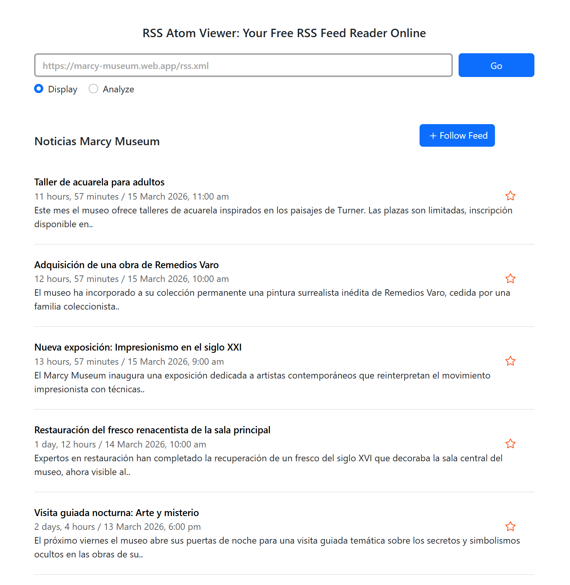

<div align="center">
  <a href="https://github.com/alexiamarcee/marcy-museum">
    
  </a>
  <h3 align="center">🎨 Marcy Museum</h3>
  <p align="center">
    A modern and responsive React application for a contemporary art museum.
    <br />
    <a href="https://github.com/alexiamarcee/marcy-museum"><strong>Explore the docs »</strong></a>
    <br />
    <br />
    <a href="https://marcy-museum.web.app">View Live Demo</a>
    ·
    <a href="https://github.com/alexiamarcee/marcy-museum/issues">Report Bug</a>
    ·
    <a href="https://github.com/alexiamarcee/marcy-museum/issues">Request Feature</a>
  </p>
</div>

---

## 🌐 Live Project
**Firebase Hosting:** https://marcy-museum.web.app  
**RSS Feed:** https://marcy-museum.web.app/rss.xml

---

## 📰 RSS Feed Preview
Below is a screenshot showing the RSS feed loaded in a feed reader, with each item linking to a news page in the app hosted on Firebase:



---

## 📚 Table of Contents

- [About The Project](#about-the-project)
- [Home Page](#home-page)
- [Built With](#built-with)
- [Third-Party Components](#third-party-components)
- [Getting Started](#getting-started)
- [Usage](#usage)
- [Roadmap](#roadmap)
- [Project Structure](#project-structure)
- [Naming Conventions](#naming-conventions)
- [Internationalization](#internationalization)
- [Firebase Integration](#firebase-integration)
- [Forum import templates](#forum-import-templates)
- [UX / UI & Clean Code](#ux--ui--clean-code)
- [Design Inspiration](#design-inspiration)
- [Helpful Tutorials](#helpful-tutorials)
- [Contributing](#contributing)
- [License](#license)
- [Contact](#contact)
- [Acknowledgments](#acknowledgments)

---

## 🏛 About The Project

Marcy Museum is a modern, responsive web application built with React that represents the official website of a contemporary art museum located in Las Palmas de Gran Canaria. The project demonstrates best practices in frontend development, including responsive design, clean code architecture, internationalization, and real-time database integration.

---

## 🏠 Home Page

The Home page is the main landing page of the application, accessible at both `/` and `/home`. It features:

- A **hero section** welcoming visitors with a title and description of the museum
- A **Current Exhibitions** section that dynamically renders exhibition cards from a JavaScript data array (`exhibitions.js`). Each card displays an image, title, artist name and description — all fully translated into English, Spanish and French
- An **interactive map** powered by Leaflet showing the exact museum location
- **Info cards** displaying the museum address, opening hours and contact details

### Other Pages

- **Exhibitions** — full grid of all artworks with translated titles and descriptions
- **Visit** — museum info, opening hours, admission prices, accessibility, parking, interactive map and contact form
- **Forum** — community forum with real-time Firebase integration (read, create, edit and delete messages, with category filter, export/import in JSON, CSV and XML). Example import files: [JSON](public/ejemplos/plantilla-foro.json) · [CSV](public/ejemplos/plantilla-foro.csv) · [XML](public/ejemplos/plantilla-foro.xml)
- **News** — RSS news feed with the latest museum updates
- **Legal pages** — Privacy Policy, Cookies Policy, Terms & Conditions and Contact, all translated into three languages

---

## 🚀 Built With

- [React](https://react.dev/)
- [Vite](https://vitejs.dev/)
- [React Router DOM](https://reactrouter.com/)
- [Leaflet](https://leafletjs.com/)
- [React Leaflet](https://react-leaflet.js.org/)
- [Firebase Realtime Database](https://firebase.google.com/)
- [i18next](https://www.i18next.com/)
- [react-i18next](https://react.i18next.com/)
- [React Icons](https://react-icons.github.io/react-icons/)
- CSS3 (Flexbox & Media Queries)

---

## 🧩 Third-Party Components

| Component | Description | Link |
|-----------|-------------|------|
| Leaflet | Interactive map showing museum location | https://leafletjs.com |
| React Leaflet | React wrapper for Leaflet maps | https://react-leaflet.js.org |
| Firebase Realtime Database | Real-time storage for forum messages | https://firebase.google.com |
| i18next | Internationalization framework (EN, ES, FR) | https://www.i18next.com |
| React Icons | Icon library used in footer and UI | https://react-icons.github.io/react-icons |
| React Router DOM | Client-side routing between pages | https://reactrouter.com |

---

## ⚙ Getting Started

### 📌 Prerequisites

- Node.js installed
- npm (comes with Node)
```sh
npm install npm@latest -g
```

### 💻 Installation

1. Clone the repository:
```sh
git clone https://github.com/alexiamarcee/marcy-museum.git
```

2. Navigate to the project folder:
```sh
cd marcy-museum
```

3. Install dependencies:
```sh
npm install
```

4. Start development server:
```sh
npm run dev
```

The application will run at:
- http://localhost:5173
- http://localhost:5173/home

---

## 🖥 Usage

Marcy Museum allows users to:

- Explore featured exhibitions dynamically rendered from a data array
- Navigate between different sections using React Router
- Switch between English, Spanish and French using the language switcher in the header
- View museum location via interactive Leaflet map
- Post, edit and delete messages in the community forum in real time via Firebase
- Export and import forum messages (JSON, CSV, XML); use the [example templates in `public/ejemplos/`](public/ejemplos/plantilla-foro.json) as a starting point
- Filter forum messages by category
- Read the latest museum news via RSS feed
- Access contact form and museum information
- Read legal pages: Privacy Policy, Cookies Policy, Terms & Conditions

---

## 🗺 Roadmap

- [x] Dynamic exhibitions from a data array
- [x] Interactive map with Leaflet
- [x] Multi-language support (EN, ES, FR) with i18next
- [x] Community Forum with Firebase Realtime Database (CRUD)
- [x] Category filter in forum
- [x] RSS News feed
- [x] Responsive design for mobile, tablet and desktop
- [x] Custom museum logo in sticky header
- [x] Legal pages with consistent formatting
- [x] Deployed to Firebase Hosting

---

## 📂 Project Structure
```
marcy-museum/
├── public/
│   ├── rss.xml                # RSS feed file
│   ├── vite.svg
│   ├── ejemplos/              # Forum import template examples (JSON, CSV, XML)
│   │   ├── plantilla-foro.json
│   │   ├── plantilla-foro.csv
│   │   └── plantilla-foro.xml
│   └── locales/               # i18n translation files
│       ├── en/translation.json
│       ├── es/translation.json
│       └── fr/translation.json
├── src/
│   ├── assets/photos/         # Images (logo, exhibitions)
│   ├── components/
│   │   ├── exhibition-card/
│   │   ├── footer/
│   │   ├── foro/              # Forum with Firebase CRUD
│   │   ├── header/
│   │   └── message-card/
│   ├── data/
│   │   └── exhibitions.js
│   ├── i18n/
│   ├── pages/
│   │   ├── exhibitions/
│   │   ├── home/
│   │   ├── locations/
│   │   ├── policy/
│   │   ├── rss/               # News RSS page
│   │   └── visit/
│   ├── services/
│   ├── App.jsx
│   └── main.jsx
├── firebase.json
├── .firebaserc
└── vite.config.js
```

---

## 📐 Naming Conventions

| Element | Convention | Example |
|---------|------------|---------|
| Folders | kebab-case | `exhibition-card` |
| Components | PascalCase | `ExhibitionCard.jsx` |
| CSS files | PascalCase | `ExhibitionCard.css` |
| CSS classes | kebab-case | `.message-card` |
| Variables | camelCase | `filteredMessages` |
| Boolean variables | is/has/should prefix | `isEditing`, `hasError` |
| JS utility files | kebab-case | `firebase-setup.js` |
| Routes | kebab-case | `/privacy-policy` |

---

## 🌍 Internationalization

The project supports three languages using i18next and react-i18next:

| Language | Code |
|----------|------|
| 🇬🇧 English | en |
| 🇪🇸 Spanish | es |
| 🇫🇷 French | fr |

Translation files are located in `public/locales/`. The `LocaleSwitcher` component in the header allows users to switch language at any time.

---

## 🔥 Firebase Integration

The community forum uses **Firebase Realtime Database**:

- Messages load in real time on page load
- Users can **create** new messages with name, message and category
- Users can **edit** any message in real time
- Users can **delete** any message in real time
- Messages can be **filtered by category** (General, Ayuda, Noticias)
- Messages are displayed in reverse chronological order
- Messages can be **exported** and **imported** in JSON, CSV or XML (via the forum UI)

Configuration is in `src/components/foro/Firebase-setup.js`. Forum data access is centralized in `src/services/Firebase-service.js`.

---

## 📥 Forum import templates

Sample files in `public/ejemplos/` match the import/export format (`sentBy`, `message`, `category`). Use them as copy-paste references or download them from the repository:

| Format | Repository file | Live site (Firebase Hosting) |
|--------|-------------------|------------------------------|
| JSON | [plantilla-foro.json](public/ejemplos/plantilla-foro.json) | [plantilla-foro.json](https://marcy-museum.web.app/ejemplos/plantilla-foro.json) |
| CSV | [plantilla-foro.csv](public/ejemplos/plantilla-foro.csv) | [plantilla-foro.csv](https://marcy-museum.web.app/ejemplos/plantilla-foro.csv) |
| XML | [plantilla-foro.xml](public/ejemplos/plantilla-foro.xml) | [plantilla-foro.xml](https://marcy-museum.web.app/ejemplos/plantilla-foro.xml) |

When running locally with Vite, the same paths are available under `http://localhost:5173/ejemplos/…` (default port).

---

## 🎨 UX / UI & Clean Code

### User Experience
- Sticky header with custom logo visible on all pages
- Hamburger menu for smooth mobile navigation
- Language switcher always accessible in the header
- Consistent color palette and typography across all pages
- Responsive design for mobile, tablet and desktop using Flexbox and media queries
- Forum with full CRUD and category search

### Clean Code Principles
- Small and reusable components
- DRY principle applied throughout
- Clear and descriptive variable naming
- Logical folder structure following conventions
- Minimal but meaningful comments

---

## 🖌 Design Inspiration

This project was inspired by the following Figma design:  
[Museum Website Figma Template](https://www.figma.com/community/file/1030946541489009680)

---

## 📖 Helpful Tutorials

- [Best README Template](https://github.com/othneildrew/Best-README-Template) — README structure
- [React Documentation](https://react.dev/)
- [React Router Documentation](https://reactrouter.com/)
- [Leaflet Documentation](https://leafletjs.com/)
- [Firebase Documentation](https://firebase.google.com/docs)
- [i18next Documentation](https://www.i18next.com/)
- [MDN Flexbox Guide](https://developer.mozilla.org/en-US/docs/Web/CSS/CSS_flexible_box_layout)
- [Shopify — Image sizes for web](https://www.shopify.com/es/blog/imagenes-para-web-tamano)

---

## 🤝 Contributing

1. Fork the repository
2. Create your Feature Branch: `git checkout -b feature/AmazingFeature`
3. Commit your changes: `git commit -m 'Add AmazingFeature'`
4. Push to the branch: `git push origin feature/AmazingFeature`
5. Open a Pull Request

---

## 📄 License

Distributed under the MIT License.

---

## 📬 Contact

Rita Alexia Marcè Acosta  
GitHub: [@alexiamarcee](https://github.com/alexiamarcee)  
Project: https://github.com/alexiamarcee/marcy-museum

---

## 🙏 Acknowledgments

- [Best README Template](https://github.com/othneildrew/Best-README-Template)
- [React Icons](https://react-icons.github.io/react-icons/)
- [Shields.io](https://shields.io/)
- [Figma Community](https://www.figma.com/community)
- [Firebase](https://firebase.google.com/)